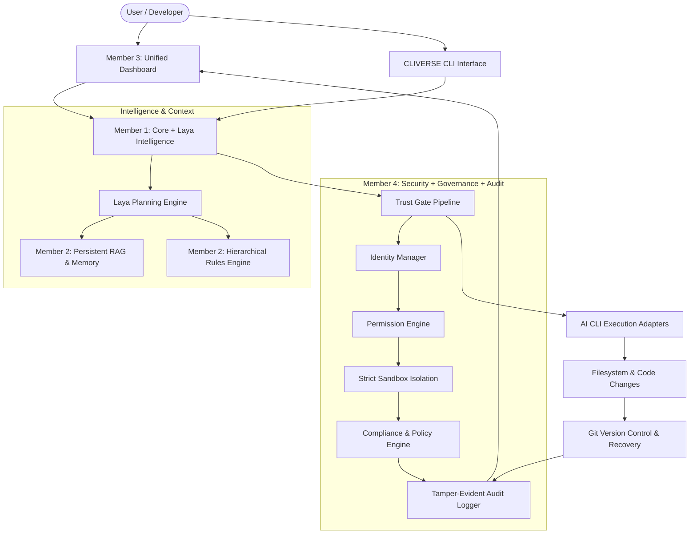

# CLIVERSE — AI CLI Intelligence Environment

> A local-first AI development environment that sits above existing AI CLIs and provides persistent context, structured prompt planning, Git-native version control, recoverability, granular permissions, regulatory governance, and a unified audit trail.

## Team

**Team Name:** CLIVERSE Team


| Member | Contribution |
| ------ | ------------ |
| **Member 1** | Core Environment, CLI Execution Pipeline, CLI Adapters, Laya Planning Layer, Filesystem Monitoring & Git Recovery |
| **Member 2** | Persistent RAG & Memory, Vector Storage/Search, Conversation Indexing & Custom Rules Engine |
| **Member 3** | Unified Dashboard Frontend (Next.js/React/Tailwind), Project Management, Live Activity & Session Viewer |
| **Member 4** | Trust & Security Layer, Permissions & Sandboxing, Secrets Protection, Regulatory Governance & Tamper-Evident Audit Logging |


## Problem Statement

### The Problem

Current AI coding CLIs (Claude Code, Gemini CLI, Cursor CLI, Aider, GitHub Copilot CLI) operate primarily as **isolated, ephemeral, and stateless command-line sessions**. 
1. **Context Amnesia**: Every new session requires re-explaining the project architecture, dependencies, and past architectural decisions.
2. **Unchecked Destructive Execution**: AI CLIs run shell commands and modify code without a formal security sandbox or regulatory compliance boundary (e.g. accidentally exposing PII, running destructive disk commands, or altering production secrets).
3. **Irreversible Mistakes**: When an agent hallucinates or damages a codebase across dozens of files, reverting the changes is difficult and error-prone without deep Git awareness.
4. **Lack of Centralized Audit & Governance**: Enterprise and development teams have no unified audit trail of what the AI did, why it made specific changes, which prompt triggered it, or whether it complied with regulations (GDPR, EU AI Act, OWASP).

### Why We Chose This Problem

As autonomous AI development tools become standard in engineering workflows, the biggest bottleneck is no longer raw model intelligence—it is **trust, control, memory, and governance**. We chose to build a foundational environment that transforms any commodity AI CLI into an enterprise-ready, memory-aware, safe, and fully auditable engineering partner.

## Solution

**CLIVERSE** sits above AI CLIs as a persistent, controlled, and versioned development environment. It intercepts developer intent, refines it through an intelligent reasoning layer (**Laya**), retrieves contextual memory via **RAG** and hierarchical rules, enforces a **5-stage Trust Gate Pipeline** (Identity → Permission → Sandbox → Compliance → Audit), and tracks every modification in Git with instant undo capabilities.

### Key Features

- **🧠 Laya Intelligent Planning Layer**: Analyzes intent, detects ambiguity, asks clarifying questions, and constructs structured prompts (ROLE, CONTEXT, TASK, CONSTRAINTS) before sending tasks to AI CLIs.
- **🗃️ Persistent RAG & Hierarchical Rules**: Remembers conversations, past decisions, architecture docs, and enforces global/project/CLI/task-level rules.
- **🔄 Git-Native Version Control & Instant Recovery**: Automatically tracks all file changes, generates atomic commits linked to session IDs, and enables `env undo` for safe experimentation.
- **🛡️ 5-Stage Trust Gate & Security Layer**: Validates agent identities, checks scoped permissions, sandboxes commands/filesystem access, and manages secrets without plaintext exposure.
- **⚖️ Regulatory Governance & Compliance Engine**: Real-time evaluation against 14+ policies referencing GDPR, EU AI Act, NIST AI RMF, OWASP Top 10, PCI-DSS, and HIPAA with ALLOW / WARN / BLOCK decisions and mandatory user confirmation.
- **🧾 Tamper-Evident Chain-Hashed Audit Trail**: Every prompt, tool execution, security check, and git commit is recorded in a cryptographic SHA-256 JSON-L ledger.
- **🖥️ Unified Control Dashboard**: Centralized UI and authenticated REST API for inspecting memory, reviewing audit trails, viewing security alerts, and managing policies.

## Innovation and Differentiation

Unlike simple wrapper scripts or single-vendor agent frameworks:
- **CLI-Agnostic Common Adapter Architecture**: Does not vendor-lock you to a single AI provider; works interchangeably with Claude, Gemini, Copilot, GPT, or custom local models.
- **Defense-in-Depth Trust Gate**: Integrates developer permissions and global regulations (GDPR/EU AI Act) directly into the execution loop before code touches the disk.
- **Cryptographic Auditability**: Uses sequential chain-hashes with full-field SHA-256 integrity verification for tamper-evident activity tracking.
- **Native Two-Way Reversibility**: Full Git-native state rollback with dependency awareness.

## Technical Implementation

### Architecture



### Technology Stack


| Category        | Technologies                |
| --------------- | --------------------------- |
| Frontend        | React, Next.js, Tailwind CSS, TypeScript / N/A |
| Backend         | Python 3.11+, FastAPI, Pydantic v2, Typer |
| Database        | SQLite (local metadata), JSON-L (Audit ledger) |
| AI / ML         | Claude 3.7 / 4.6, Gemini 2.0 / 3.7, Embeddings RAG |
| Infrastructure  | Git-native versioning, OS Process Sandboxing |
| APIs / Services | Authenticated REST API, CLI Entrypoint (`cliverse-security`) |


### How It Works

1. **Session & Identity Initialization**: When an AI CLI session starts, `IdentityManager` issues a cryptographically fingerprinted session token with scoped permissions, preventing privilege escalation.
2. **Intent & Planning**: The user's prompt is parsed by Laya, augmented with RAG embeddings and active project rules.
3. **Trust Gate Evaluation**: Before execution, `TrustGate` passes the task through:
   - **PermissionEngine**: Verifies scopes, file boundaries, and blocks dangerous commands (`rm -rf /`, `DROP TABLE`, fork bombs).
   - **Strict Sandbox**: Enforces execution limits, environment variable scrubbing (removing sensitive credentials), and path constraints.
   - **PolicyEngine & ComplianceChecker**: Flags PII leakage, OWASP vulnerabilities, hardcoded secrets, or EU AI Act high-risk operations with mandatory confirmation on warnings.
4. **Execution & Git Commit**: The AI CLI performs the operation; diffs are captured and committed atomically to Git with metadata.
5. **Chain-Hashed Audit**: `AuditLogger` writes SHA-256 chain-linked records with automatic secret redaction and cryptographic integrity checks.

### Technical Decisions

- **Modularity via Decoupled 4-Member Interfaces**: Modules communicate strictly through public Python classes and REST endpoints (`api.py`), enabling independent development across the team.
- **Fail-Closed Security Posture**: Unknown identities, syntax errors, or unhandled states default to `BLOCK` rather than permissive execution.
- **In-Memory Secrets Vault with Automatic Redaction**: Sensitive API tokens and credentials never touch disk logs in plaintext.

## Implementation During the Hackathon

During the Hack Day, we built and delivered the complete foundational **Security + Governance + Audit Layer (Member 4)** and its integration gates:

- Implemented `security/identity.py` for CLI session identity registration, token validation, and scope escalation prevention.
- Implemented `security/permissions.py` with multi-tier scope checks and regex-based dangerous pattern prevention.
- Implemented `security/sandbox.py` supporting `STRICT`, `PERMISSIVE`, and `DRY_RUN` execution modes with environment variable scrubbing.
- Implemented `security/secrets.py` with in-memory storage and log redaction.
- Implemented `governance/policies.py` with 14 machine-readable policies mapped to real-world regulations (GDPR, EU AI Act, OWASP, PCI-DSS, HIPAA).
- Implemented `governance/regulatory.py` and `governance/compliance.py` for live compliance auditing, regulatory feed synchronization, and actionable recommendations.
- Implemented `audit/events.py` with full-field SHA-256 cryptographic chain hashing and tamper verification.
- Built `trust_gate.py` unified pipeline orchestrator with mandatory user confirmation on warnings.
- Built `api.py` authenticated FastAPI server and `cli.py` terminal tool.
- Built unit test suite (`run_tests.py`) and live simulation demo (`demo_simulation.py`) passing 100% of test cases.

### Team Contributions

- **Member 1 (Core + Laya):** CLI execution pipeline, adapter abstraction, prompt structuring, and Git recovery engine.
- **Member 2 (RAG + Rules):** Persistent memory index, vector embeddings, rule hierarchy (Global -> Project -> CLI -> Task).
- **Member 3 (Dashboard + UX):** Central control UI, session manager, policy editor, and live event monitoring.
- **Member 4 (Security + Governance + Audit):** Trust Gate pipeline, identity tokens, permissions, strict sandboxing, regulatory compliance engine, and tamper-evident audit logging.

## Working Application

**Live Application:** Local CLI & REST API Service (`http://localhost:8000/api/v1/security`)

The security pipeline, audit logger, and governance engine can be executed and tested directly via the CLI tool or REST endpoints.

## Demo Video & Live Simulation

- **Interactive Terminal Simulation:** Run `python demo_simulation.py` to see all 6 stages of the Trust Gate executed live in sub-seconds.
- **Project Walkthrough:** [CLIVERSE GitHub Repository Showcase](https://github.com/seshasaipardhiv-cloud/CLIVERSE)

## Open Source and AI Usage

### AI / Models

- **Claude Sonnet / Gemini Models:** Used for intent reasoning, prompt structuring in Laya, and test generation.

### Open Source Components

- **FastAPI / Pydantic (MIT License):** High-performance REST API routing and type validation.
- **Pytest / Unittest (MIT / Python Software Foundation License):** Automated test verification.
- **Typer / Argparse:** CLI terminal interface.

## Setup and Usage

### Prerequisites

- Python 3.10+
- Git 2.30+

### Installation

```bash
git clone https://github.com/seshasaipardhiv-cloud/CLIVERSE.git
cd CLIVERSE
pip install -r requirements.txt
```

### Environment Variables

*All environment variables are optional. CLIVERSE runs 100% locally out-of-the-box without requiring third-party API keys.*

```env
# Optional configuration
CLIVERSE_ADMIN_API_KEY=cliverse-admin-default-key
CLIVERSE_ENV_ROOT=.envcore
```

### Running the Project

**Run the automated test suite:**
```bash
python run_tests.py
```

**Run the live Trust Gate demo:**
```bash
python demo_simulation.py
```

**Launch the REST API server:**
```bash
uvicorn api:create_app --factory --reload --port 8000
```

### Usage

**1. Inspect active governance & regulatory policies:**
```bash
python cli.py policies
python cli.py regulatory
```

**2. Register a CLI agent session:**
```bash
python cli.py register-agent claude-cli
```

**3. Evaluate commands against the Trust Gate:**
```bash
# Blocked dangerous command
python cli.py check "rm -rf /"

# Permitted safe command
python cli.py check "git status"
```

**4. View and cryptographically verify the audit trail:**
```bash
python cli.py audit
python cli.py audit-verify
```

## Devpost / Hackathon Submission

- **Event:** [Hacktoberfest Hack Day Coimbatore (INIT Club & IDEA Club)](https://mlh.com/events/hacktoberfest-hack-day-coimbatore-x-init-club/challenges)
- **Repository:** [https://github.com/seshasaipardhiv-cloud/CLIVERSE](https://github.com/seshasaipardhiv-cloud/CLIVERSE)

## Credits and License

### Credits

- Built for **Hacktoberfest Hack Day Coimbatore** organized by INIT Club & IDEA Club in collaboration with Major League Hacking (MLH).
- Regulatory guidelines referenced from **EUR-Lex (EU AI Act, GDPR)**, **NIST (AI RMF)**, and **OWASP**.

### License

Distributed under the **MIT License**.

## Submission Checklist

- [x] Project title and description added
- [x] All team members listed
- [x] Problem clearly explained
- [x] Reason for choosing the problem explained
- [x] Solution and key features documented
- [x] Innovation and differentiation explained
- [x] Architecture included (Mermaid diagram)
- [x] Technical implementation documented
- [x] Work completed during the hackathon documented
- [x] Team contributions documented
- [x] Working application is functional
- [x] Live application / API instructions added
- [x] Demo and live simulation script tested
- [x] AI and open-source components documented
- [x] Setup and usage instructions tested
- [x] Technical decisions documented
- [x] Hackathon event and repository links added
- [x] Credits added
- [x] License added
- [x] Repository is organized and complete
